<!-- profile cards updated: 2026-03-01 -->
<!-- Typing SVG header - cyan accent -->

<!-- Short tagline with color accents -->

  <strong>CS @ Cornell</strong>
   · 
  Full Stack Development
   · 
  AI Agents
   · 
  Distributed Systems
   · 
  Robotics

<!-- Badges row - vibrant palette -->

  

<!-- GitHub Stats (generated by workflow) -->

 

<!-- Top languages -->

---

## 📌 Featured repositories

<table>
<tr>
<td width="50%" valign="top">

**[LangAlpha](https://github.com/ginlix-ai/LangAlpha)**  
From vibe coding to vibe investing — AI finance agent (Gemini 3, LangChain, PTC)  

</td>
<td width="50%" valign="top">

**[GroceryManager](https://github.com/leo-Zhizhu/GroceryManager)**  
Full-stack grocery lists · Spring Boot, React, AWS App Runner  

</td>
</tr>
<tr>
<td width="50%" valign="top">

**[Pixel Social](https://github.com/leo-Zhizhu/Pixel-Social)**  
Upload, create & share images/videos · React, Go, Elasticsearch, DALL·E 3  

</td>
<td width="50%" valign="top">

**[MiniSpotify](https://github.com/leo-Zhizhu/MiniSpotify)**  
Lightweight Android music app · Kotlin, Ktor, ExoPlayer, Jetpack Compose  

</td>
</tr>
<tr>
<td width="50%" valign="top">

**[PaperChat](https://github.com/leo-Zhizhu/PaperChat)**  
RAG + web search chat · PDF context, voice I/O · Node.js, React, LangChain, MCP  

</td>
<td width="50%" valign="top"></td>
</tr>
</table>

---

<table>
<tr>
<td>

## 🧭 What I Care About

I'm at the intersection of **AI agents**, **backend systems**, and **real-world reliability** — not just models that look good in a notebook.

| **Focus** | **Why it matters** |
|-----------|---------------------|
| **AI Agents & LLM Systems** | Orchestration that users can trust |
| **Backend & Distributed Systems** | Scale without the surprise failures |
| **Interactive UI/UX** | Humans in the loop, user experience is the key |
| **Robotics & Control** | Software that moves the physical world |
| **Explainable engineering** | *Can users trust it?* not just *can it run?* |

</td>
</tr>
</table>

<blockquote style="border-left: 4px solid #22d3ee; padding: 12px 20px; margin: 16px 0; background: #0f172a; border-radius: 0 8px 8px 0;">
  <strong style="color:#22d3ee">My north star:</strong> The user understands <em>why</em> the system produced the answer — not just what the answer is.
</blockquote>

---

<table>
<tr>
<td width="50%">

### 🧩 How I Think About Engineering

Good engineering is **tradeoffs**, not perfect solutions.

**I value**
- Clarity over cleverness  
- Observability over magic  
- Iteration over over-design  
- User needs over technical ego  
- Communication + teamwork over working alone  

</td>
<td width="50%">

### 🌱 Currently Learning

- Full stack application development  
- Reliable agent orchestration  
- Human–AI interaction patterns  
- System design at scale  
- Robust real-world automation  
- Robotics control powered by AI  

</td>
</tr>
</table>

---

## 📫 Reach Me

<i style="color:#94a3b8">Always open to collaboration, research, and interesting problems.</i>

---

<!-- Contribution graph snake -->
<picture>
  <source media="(prefers-color-scheme: dark)" srcset="./assets/github-contribution-grid-snake-dark.svg">
  <source media="(prefers-color-scheme: light)" srcset="./assets/github-contribution-grid-snake.svg">
  
</picture>

Software is not just logic — it's a contract with reality.

