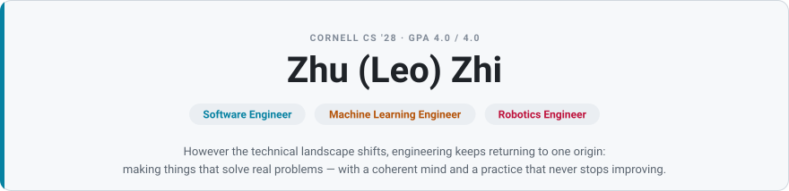
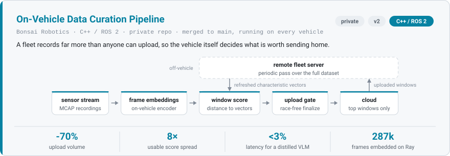
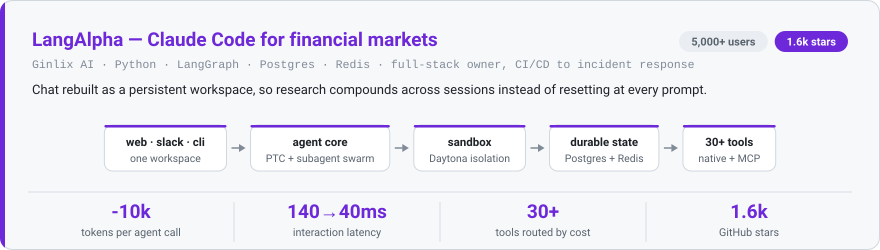
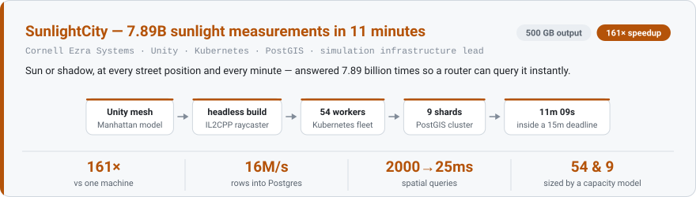
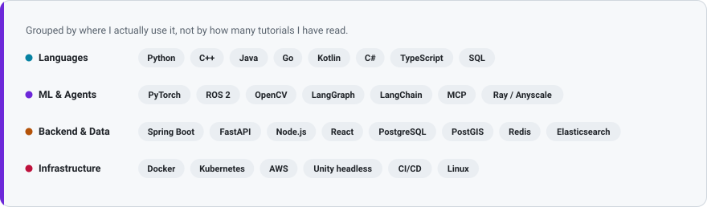
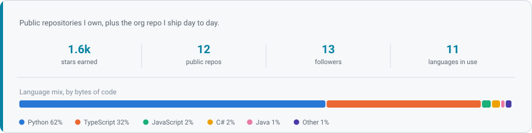

<!-- profile cards updated: 2026-08-01 -->
<!-- Cards in ./profile are generated: python3 tools/generate_profile_cards.py -->

<picture>
  <source media="(prefers-color-scheme: dark)" srcset="./profile/hero-dark.svg">
  
</picture>

---

## Numbers I moved

<picture>
  <source media="(prefers-color-scheme: dark)" srcset="./profile/impact-dark.svg">
  
</picture>

---

## Work worth a closer look

### Bonsai Robotics · Machine Learning Engineering Intern

<picture>
  <source media="(prefers-color-scheme: dark)" srcset="./profile/card-bonsai-dark.svg">
  
</picture>

Private company repo, so there is no link — this is the part I can describe.

- A fleet records far more than the network can carry home. The pipeline scores every recording window **on the vehicle** and uploads only the informative ones, cutting upload volume **~70%**. Merged to main and running on every vehicle.
- Four orthogonal per-frame signals — spatial density, semantic composition, anomalous detections, temporal motion — collapse into one window score. Retuning the thresholds and formulas against real field data widened the usable score spread **8×** (σ 0.021 → 0.169), so short bursts of interest survive long stretches of ordinary driving.
- Re-architected critical uploads around an explicit boundary between the **data layer** (recorder-owned MCAP files) and the **annotation layer** (pipeline-owned time windows), and closed the open-recording race by parking windows whose tail extends into the active file, then finalizing them when a covering file closes.
- Distilling image–language ability from TIPSv2 into the production BEV perception backbone for **under 3%** added latency, verified against the teacher on a 24,471-pair benchmark I designed.
- Made the team's shared embedding package encoder-agnostic (registry + factory) and embedded **287k frames** through CLIP, TIPSv2 and SigLIP2 on an autoscaling Anyscale Ray GPU cluster.

### Ginlix AI · Full-Stack Software Engineer

<picture>
  <source media="(prefers-color-scheme: dark)" srcset="./profile/card-langalpha-dark.svg">
  
</picture>

[**Repository**](https://github.com/ginlix-ai/LangAlpha) · [**langalpha.ai**](https://langalpha.ai) · 1.6k stars · 5,000+ users

- Rebuilt chat as a **persistent workspace** so users can stop and resume mid-task: Daytona-sandboxed tool execution, PostgreSQL/Redis-backed conversation state, subagent dispatch, memory compaction and durable file storage.
- Traced **~10k tokens per call** of pure overhead to unused tool schemas shipping on every request, and replaced the static manifest with on-demand tool discovery.
- Cut Interaction to Next Paint from **140 ms to 40 ms** by moving fetch state into TanStack Query.
- Routed queries between in-context lookups (SEC filings) and sandboxed bulk processing across **30+ native and MCP tools**, so large jobs never exhaust the context window.
- Own the production release lifecycle end to end — CI/CD, schema migrations, incident response.

### Cornell Ezra Systems · Simulation Infrastructure Lead

<picture>
  <source media="(prefers-color-scheme: dark)" srcset="./profile/card-sunlightcity-dark.svg">
  
</picture>

[**Repository**](https://github.com/leo-Zhizhu/SunlightCity------Large-Scale-Simulation-Data-Pipeline) · 7.89B measurements · 500 GB · 11m 09s

- The question, asked 7.89 billion times: *at this spot on this street, at 09:03 on 15 June — sun, or shadow?* Unity's physics engine answers one instance by casting a ray at the sun; **54 Kubernetes workers** and a **9-instance PostgreSQL cluster** answer all of them and land 500 GB in **11m 09s**. The same work takes **30 hours** on one machine.
- The fleet size and the shard count were not guessed. Both are **derived from a 15-minute deadline** by a capacity model that ships in the repo and re-runs in one command.
- Containerized the physics engine as a headless Linux IL2CPP build and MapReduce-partitioned the workload, after converting unstructured Unity city models into a routable graph via procedural mesh-to-graph extraction.
- Diagnosed database I/O as the ingestion bottleneck and retuned PostGIS spatial indexing, memory allocation and bulk-insert chunk sizing — queries dropped from **~2000 ms to ~25 ms**.

---

## Stack

<picture>
  <source media="(prefers-color-scheme: dark)" srcset="./profile/stack-dark.svg">
  
</picture>

---

## Also on the shelf

| Project | What it is | Notable |
|---|---|---|
| **[GroceryManager](https://github.com/leo-Zhizhu/GroceryManager)** | Grocery list service — Spring Boot, React, AWS App Runner | Moved search to Elasticsearch: **~400 ms faster**, typo-tolerant. Shared Redis session store so instances scale without pinning |
| **[Pixel Social](https://github.com/leo-Zhizhu/Pixel-Social)** | Social platform for creating and sharing images and video — React, Go, Elasticsearch, DALL·E 3 | Go backend over an Elasticsearch index, with generative image creation in the upload flow |
| **[PaperChat](https://github.com/leo-Zhizhu/PaperChat)** | RAG + web-search chat over your own PDFs, with voice I/O — Node.js, React, LangChain, MCP | Retrieval and live search share one answer path, so citations stay attached to what was actually read |
| **[MiniSpotify](https://github.com/leo-Zhizhu/MiniSpotify)** | Android music client — Kotlin, ExoPlayer, Jetpack Compose | Room + Kotlin Flows stale-while-revalidate cache: **~80% faster** returning-user load. Retrofit/OkHttp backoff cut failed requests **25%** |
| **[Cornell AUV](https://cuauv.org)** | Autonomous underwater vehicle — perception, control, mission stack | Fit nonlinear models to 6-DoF pool-test data to find controller parameters hand-tuning missed: **80% less** steady-state error. Adaptive thresholding on the YOLOv7 pipeline removed the pre-test manual retune |

---

## GitHub

<picture>
  <source media="(prefers-color-scheme: dark)" srcset="./profile/github-dark.svg">
  
</picture>

<picture>
  <source media="(prefers-color-scheme: dark)" srcset="./assets/github-contribution-grid-snake-dark.svg">
  
</picture>

---

## How I think about the work

| | |
|---|---|
| **Tradeoffs, not perfect solutions** | Clarity over cleverness · observability over magic · iteration over over-design |
| **The real world is the test** | A feature is cheap; a feature that holds under load, bad networks and odd inputs is the job |
| **Humans stay in the loop** | The user should understand *why* the system produced an answer, not just what it was |
| **Currently learning** | Reliable agent orchestration · AI infrastructure · robotics control powered by ML · system design at scale |

 

**Open to internships, coffee chats, collaboration, research, and interesting challenges.**

<i>Software is not just logic — it's a contract with reality.</i>

