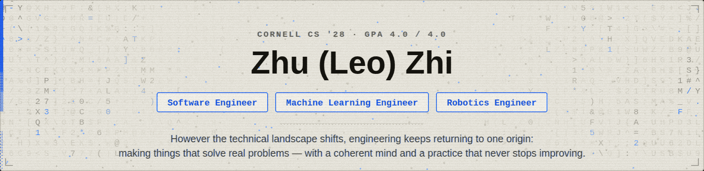
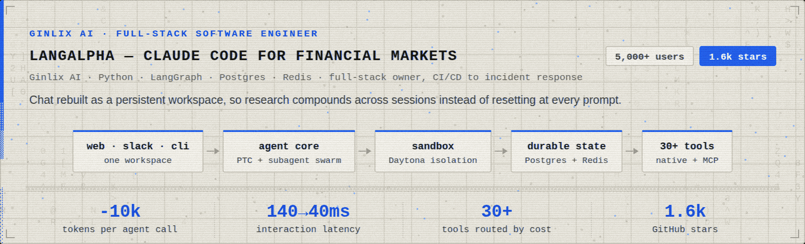
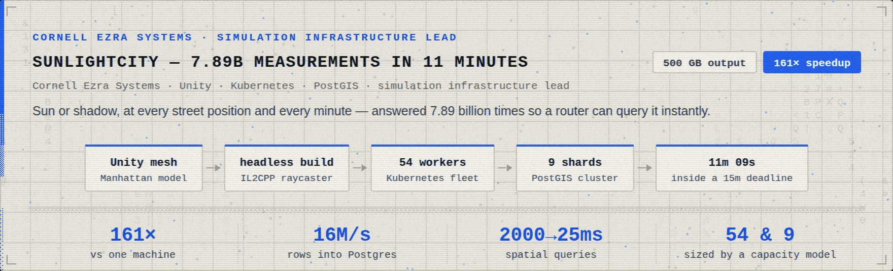
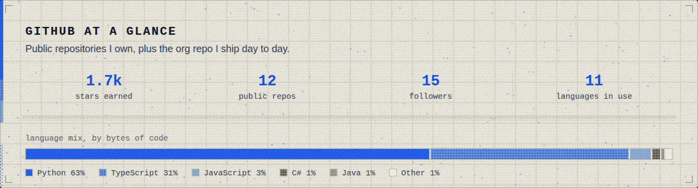

<!-- profile cards updated: 2026-08-19 -->
<!-- Cards: python3 tools/generate_profile_cards.py && python3 tools/render_cards.py -->

<picture>
  <source media="(prefers-color-scheme: dark)" srcset="./profile/hero-crt.png">
  
</picture>

<a href="mailto:zhizhu0730@gmail.com"><picture><source media="(prefers-color-scheme: dark)" srcset="https://img.shields.io/badge/Email-zhizhu0730@gmail.com-2563eb?style=flat-square&labelColor=121212&logo=gmail&logoColor=ffffff"></picture></a>
<a href="mailto:zz766@cornell.edu"><picture><source media="(prefers-color-scheme: dark)" srcset="https://img.shields.io/badge/Cornell-zz766@cornell.edu-333333?style=flat-square&labelColor=121212&logo=data%3Aimage%2Fsvg%2Bxml%3Bbase64%2CPHN2ZyB4bWxucz0iaHR0cDovL3d3dy53My5vcmcvMjAwMC9zdmciIHZpZXdCb3g9IjAgMCAyNCAyNCI%2BPHBhdGggZmlsbD0iI2I0YjRiNCIgZD0iTTEyIDMgMSA5bDExIDYgOS00LjkxVjE3aDJWOUwxMiAzek01IDEzLjE4djRMMTIgMjFsNy0zLjgydi00TDEyIDE3bC03LTMuODJ6Ii8%2BPC9zdmc%2B"></picture></a>
<a href="https://linkedin.com/in/zhu-zhi-506499376"><picture><source media="(prefers-color-scheme: dark)" srcset="https://img.shields.io/badge/LinkedIn-Zhu_Zhi-333333?style=flat-square&labelColor=121212&logo=data%3Aimage%2Fsvg%2Bxml%3Bbase64%2CPHN2ZyB4bWxucz0iaHR0cDovL3d3dy53My5vcmcvMjAwMC9zdmciIHZpZXdCb3g9IjAgMCAyNCAyNCI%2BPHBhdGggZmlsbD0iI2I0YjRiNCIgZD0iTTIwIDNINGEyIDIgMCAwIDAtMiAydjE0YTIgMiAwIDAgMCAyIDJoMTZhMiAyIDAgMCAwIDItMlY1YTIgMiAwIDAgMC0yLTJ6bS04IDRhMi41IDIuNSAwIDEgMSAwIDUgMi41IDIuNSAwIDAgMSAwLTV6bTUgMTFIN3YtMWMwLTEuNjYgMy4zMy0yLjUgNS0yLjVzNSAuODQgNSAyLjV2MXoiLz48L3N2Zz4%3D"></picture></a>

---

<picture>
  <source media="(prefers-color-scheme: dark)" srcset="./profile/impact-crt.png">
  
</picture>

---

<picture>
  <source media="(prefers-color-scheme: dark)" srcset="./profile/card-bonsai-crt.png">
  
</picture>

Private company repo, so there is no link — this is the part I can describe.

- A fleet records far more than the network can carry home. The pipeline scores every recording window **on the vehicle** and uploads only the informative ones, cutting upload volume **~70%**. Merged to main and running on every vehicle.
- **v1** scored each frame on four orthogonal signals — spatial density, semantic composition, anomalous detections, temporal motion — collapsing them into one window score. Retuning the thresholds and formulas against real field data widened the usable score spread **8×** (σ 0.021 → 0.169), so short bursts of interest survive long stretches of ordinary driving.
- **v2** replaces those hand-tuned scorers with embedding-based scoring, and closes the loop: a remote fleet server makes a periodic pass over the full uploaded dataset and pushes refreshed characteristic vectors down to every vehicle, which then scores each window by its distance to them. What counts as interesting stops being a constant someone tuned and starts tracking what the fleet has already seen.
- Re-architected critical uploads around an explicit boundary between the **data layer** (recorder-owned MCAP files) and the **annotation layer** (pipeline-owned time windows), and closed the open-recording race by parking windows whose tail extends into the active file, then finalizing them when a covering file closes.
- Distilling image–language ability from TIPSv2 into the production BEV perception backbone for **under 3%** added latency, verified against the teacher on a 24,471-pair benchmark I designed.
- Made the team's shared embedding package encoder-agnostic (registry + factory) and embedded **287k frames** through CLIP, TIPSv2 and SigLIP2 on an autoscaling Anyscale Ray GPU cluster.

<picture>
  <source media="(prefers-color-scheme: dark)" srcset="./profile/card-langalpha-crt.png">
  
</picture>

[**Repository**](https://github.com/ginlix-ai/LangAlpha) · [**langalpha.ai**](https://langalpha.ai) · 1.6k stars · 5,000+ users

- Rebuilt chat as a **persistent workspace** so users can stop and resume mid-task: Daytona-sandboxed tool execution, PostgreSQL/Redis-backed conversation state, subagent dispatch, memory compaction and durable file storage.
- Traced **~10k tokens per call** of pure overhead to unused tool schemas shipping on every request, and replaced the static manifest with on-demand tool discovery.
- Cut Interaction to Next Paint from **140 ms to 40 ms** by moving fetch state into TanStack Query.
- Routed queries between in-context lookups (SEC filings) and sandboxed bulk processing across **30+ native and MCP tools**, so large jobs never exhaust the context window.
- Own the production release lifecycle end to end — CI/CD, schema migrations, incident response.

<picture>
  <source media="(prefers-color-scheme: dark)" srcset="./profile/card-sunlightcity-crt.png">
  
</picture>

[**Repository**](https://github.com/leo-Zhizhu/SunlightCity------Large-Scale-Simulation-Data-Pipeline) · 7.89B measurements · 500 GB · 11m 09s

- The question, asked 7.89 billion times: *at this spot on this street, at 09:03 on 15 June — sun, or shadow?* Unity's physics engine answers one instance by casting a ray at the sun; **54 Kubernetes workers** and a **9-instance PostgreSQL cluster** answer all of them and land 500 GB in **11m 09s**. The same work takes **30 hours** on one machine.
- The fleet size and the shard count were not guessed. Both are **derived from a 15-minute deadline** by a capacity model that ships in the repo and re-runs in one command.
- Containerized the physics engine as a headless Linux IL2CPP build and MapReduce-partitioned the workload, after converting unstructured Unity city models into a routable graph via procedural mesh-to-graph extraction.
- Diagnosed database I/O as the ingestion bottleneck and retuned PostGIS spatial indexing, memory allocation and bulk-insert chunk sizing — queries dropped from **~2000 ms to ~25 ms**.

---

<picture>
  <source media="(prefers-color-scheme: dark)" srcset="./profile/stack-crt.png">
  
</picture>

---

<picture>
  <source media="(prefers-color-scheme: dark)" srcset="./profile/shelf-crt.png">
  
</picture>

[GroceryManager](https://github.com/leo-Zhizhu/GroceryManager) · [Pixel Social](https://github.com/leo-Zhizhu/Pixel-Social) · [PaperChat](https://github.com/leo-Zhizhu/PaperChat) · [MiniSpotify](https://github.com/leo-Zhizhu/MiniSpotify) · [Cornell AUV](https://cuauv.org)

---

<picture>
  <source media="(prefers-color-scheme: dark)" srcset="./profile/github-crt.png">
  
</picture>

<picture>
  <source media="(prefers-color-scheme: dark)" srcset="./assets/snake-crt.svg">
  
</picture>

---

<picture>
  <source media="(prefers-color-scheme: dark)" srcset="./profile/principles-crt.png">
  
</picture>

 

**Open to internships, coffee chats, collaboration, research, and interesting challenges.**

<i>Software is not just logic — it's a contract with reality.</i>

